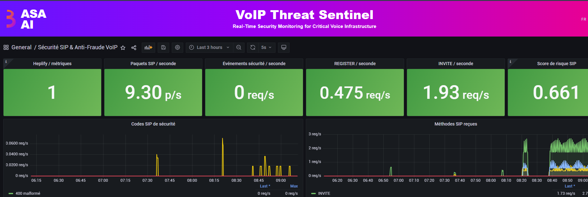
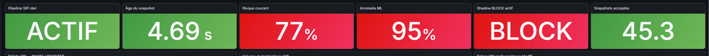
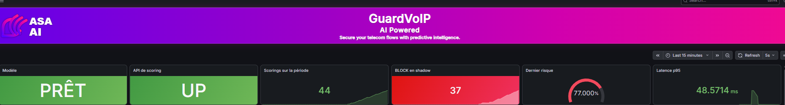
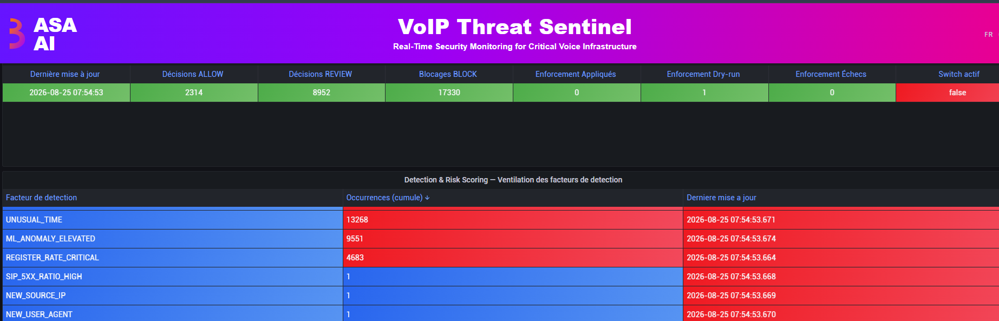


<a href="README.md">🌐 English</a> · <a href="README.fr.md">Français</a> · <b>Español</b>

# 🛰️ ASA-AI VoIP Threat Sentinel

### Detección de fraude y amenazas VoIP en tiempo real, impulsada por IA

**Vea el fraude venir — y deténgalo — antes de que llegue a su factura.**

---

## El fraude VoIP no avisa. Threat Sentinel sí.

El fraude en telecomunicaciones se estima en **decenas de miles de millones de dólares al año** (fuente: CFCA). IRSF, PBX comprometidos, spoofing de identidad, floods SIP: la mayoría lo descubre **en la factura**. Demasiado tarde.

**ASA-AI VoIP Threat Sentinel** supervisa sus flujos SIP de forma continua, **puntúa el riesgo en tiempo real** con IA y **bloquea** el comportamiento fraudulento — automáticamente.

### 📡 Supervisión en tiempo real de su infraestructura de voz

## El motor de IA en acción

Scoring de riesgo continuo, detección de anomalías ML y **bloqueo automático** — en modo observación (shadow) o activo:

## 🧠 Detección y scoring de riesgo — diseñado para ataques automatizados (IA)

El fraude VoIP moderno está cada vez más automatizado — scripts, bots y herramientas impulsadas por IA. Threat Sentinel no depende de una sola firma: combina **múltiples factores de comportamiento** con una **puntuación de anomalía ML** para desenmascarar el tráfico malicioso, incluso nuevo.

Cada llamada se evalúa según factores como horario inusual, anomalía ML elevada, tasa de REGISTER crítica, ratios de errores SIP anómalos, o fuentes/agentes nunca vistos — alimentando una puntuación de riesgo global que decide **ALLOW / REVIEW / BLOCK**.

> Los umbrales, pesos y modelos exactos son propiedad de ASA AI — se muestran en una demo privada.

## Qué obtiene

| | |
|---|---|
| 🔎 **Tiempo real** | Amenazas detectadas durante la llamada, no en la factura. |
| 🧠 **Scoring IA** | Priorización inteligente: menos ruido, menos falsos positivos. |
| 🛡️ **Anti-fraude** | IRSF, enumeración, brute-force de cuentas SIP, spoofing. |
| 🔁 **Bloqueo auto** | Modo shadow (observación) o activo, a su elección. |
| 🔌 **Se integra** | Con su infraestructura VoIP existente — sin reemplazarla. |

## ¿Para quién?

- **Operadores e integradores VoIP** — proteger plataformas de clientes contra el fraude.
- **Empresas** — asegurar el PBX y los trunks SIP.
- **MSSP / SOC** — añadir la **capa de voz** a la supervisión de seguridad.

---

## 🔒 ¿Y lo demás?

Las capturas muestran **lo que Threat Sentinel detecta**. La **arquitectura**, los **modelos de detección** y las **reglas de scoring** — el verdadero know-how de ASA AI — se revelan en una **demo privada**, sobre su propio contexto.

## 🚀 Solicite su demostración

### 📩 **contact@asa-ai.fr** · 🌐 **[asa-ai.fr](https://www.asa-ai.fr)**

---

## Acerca de ASA AI

**ASA AI** desarrolla soluciones de **seguridad VoIP** y **automatización del SOC** impulsadas por IA.

🌐 [asa-ai.fr](https://www.asa-ai.fr) · 📩 [contact@asa-ai.fr](mailto:contact@asa-ai.fr) · 💼 [LinkedIn](https://www.linkedin.com/in/asa-ai-101815430/)

© ASA AI · AI Security & SOC Automation · Île-de-France, France
